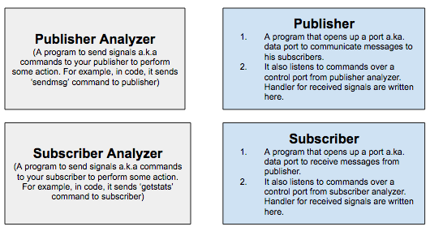

# HelloWorld [](https://travis-ci.org/tahir24434/HelloWorld)
This is a tutorial that show how hydra can be used to develop test 
cases with many processes on many nodes interacting in client server 
type communication.
Clone HelloWorld repo using command
```
git clone --recursive git@github.com:lake-lerna/HelloWorld.git
```

# Prerequisits
Make sure [Hydra](https://github.com/lake-lerna/hydra) dependencies are 
met.
Place correct hydra.ini file at root directory of cloned repository.
A sample hydra.ini file is given at root.
  
#Installation 
```
./install_hydra.sh
```
# Components


# How components interact
1. Using publisher analyzer, test will send 'sendmsg' signal with argument 'x' to publisher.
2. Publisher on recieving the signal will send 'x' number of messages to subsciber.
3. Using subscriber analyzer, test will send 'getstats' signal to subscriber.
4. Subscriber will respond with number 'x' (number of messages received by subscriber from publisher)
5. Sent and recieved messages will be compared to decide about success/failure.


# Running the test
```
./run_helloworld.sh 1555 10
```
where first argument is publisher port (you can give any available port).
while second argument is number of messages to send from publisher to subscriber.
Default arguments are port=1555 and num-messages=10.
